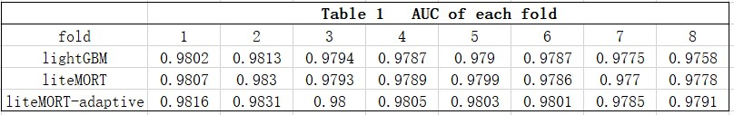
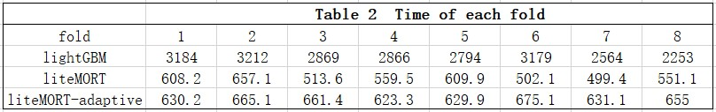

This tutorial demonstrates how to use [LiteMORT](https://github.com/closest-git/LiteMORT "LiteMORT") to solve [IEEE-CIS Fraud Detection competition](https://www.kaggle.com/c/ieee-fraud-detection/overview "IEEE-CIS Fraud Detection competition").Both data and most codes are forked from kyakovlev's notebook (https://www.kaggle.com/kyakovlev/ieee-simple-lgbm). I just add LiteMORT to compare performace with LightGBM.  LiteMORT is trying some adaptive algorithms to get higher accuracy.  So I name these new algorithms as "liteMORT-adaptive" in the following comparison.

Table 1 is the auc of each fold. Table 2 is the time of each fold. 

We can see that 

1）In this competition, **LiteMORT is much faster than LightGBM**. LiteMORT needs only  a quarter of the time of lightGBM.

2）In this competition, **LiteMORT has higher auc than lightGBM**. And with adaptive algorithms, "liteMORT-adaptive" would achieve higher accuracy.

Detailed steps are as follows
1. Download three pkl files(remove_features.pkl,test_df.pkl,train_df.pkl) from https://www.kaggle.com/kyakovlev/ieee-fe-with-some-eda.(Thanks very much for kyakovlev's work!)
Save these files to the dir `input\ieee-fe-with-some-eda\`

1. `cd src` and Run the following command in Anaconda:
`python case_ieee_fraud.py mort`

I'm busy in developing LiteMORT. So have little time to do EDA.I would join a team with rich experience in feature engineering. If any team need an expert in gradient boosting algorithm, please contanct me. Feature engineering is the key in many practical applications and kaggle competitions. It's really hard to do automatic feature engineering to improve GBDT. Any suggestion are welcome.
